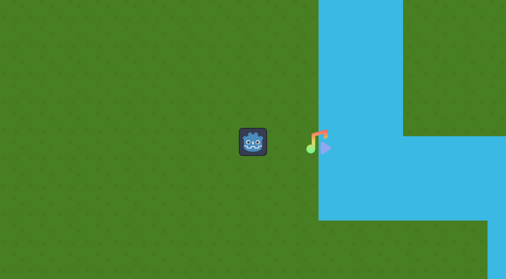
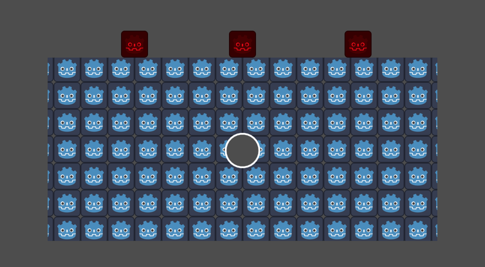
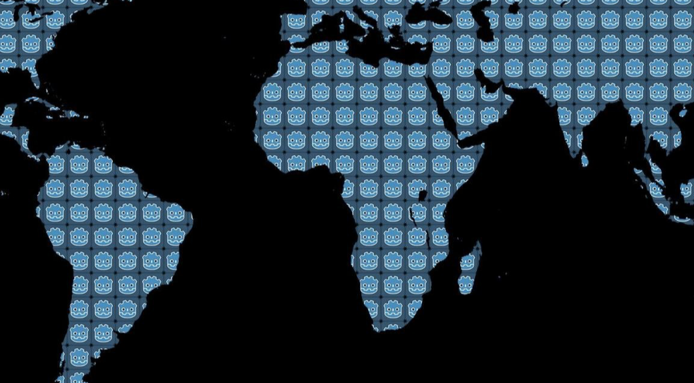
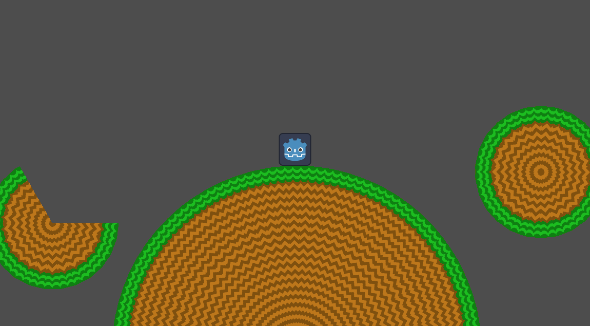

# Godot Scripts
This is a collection of GDScript files I wrote, that might be useful to others. Feel free to use them however you like! Follow me on [Mastodon](https://mastodon.gamedev.place/@julianvos) or [X](https://twitter.com/julian_vosje) for demonstrations and more.

## AudioStreamPlayerArea2D
A node like `AudioStreamPlayer2D`, but plays from a polygonal area rather than a single point.

## DestructiblePolygon2D
A node for free-form destruction (and creation) of polygonal terrain. Define the initial terrain with `Polygon2D` children, then call `destruct` on it to erase a polygonal area.

## MapCamera2D
A node that adds mouse, keyboard and gesture zooming, panning and dragging to `Camera2D`.

## TextureCircle
A node for drawing textured circles, arcs and ellipses, with optional collision.

